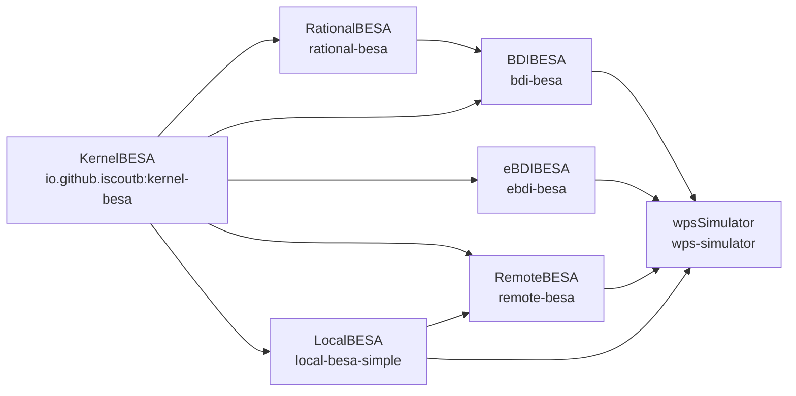
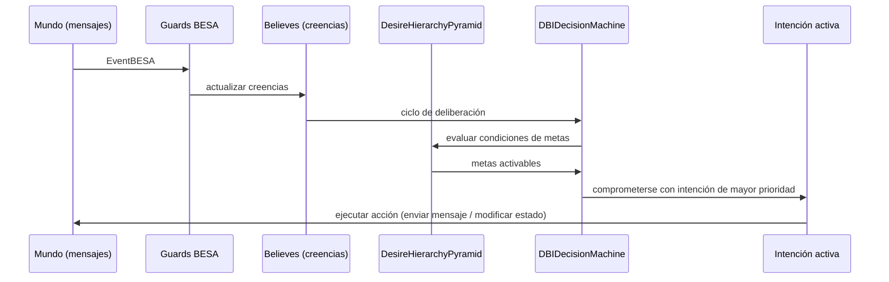
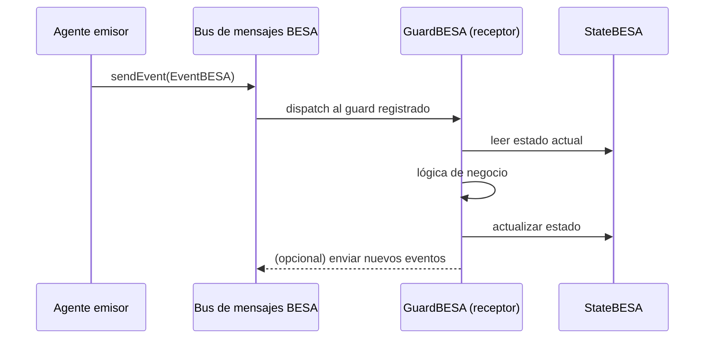
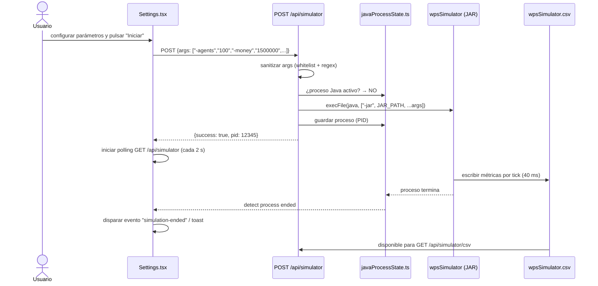
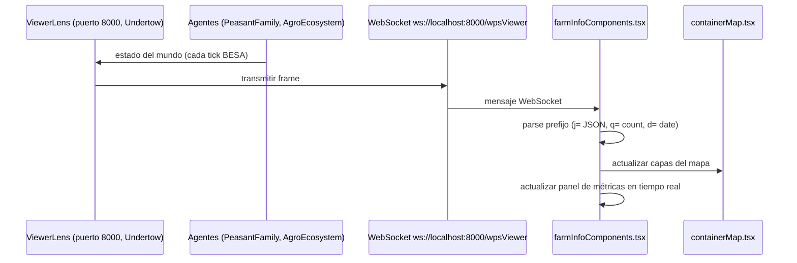
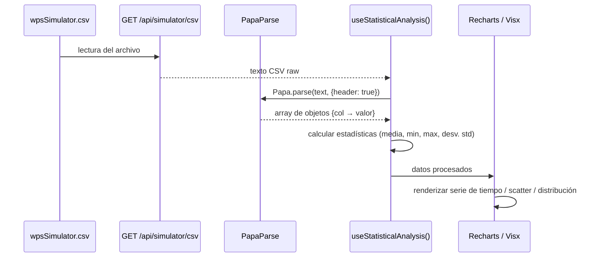
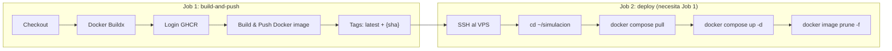

# Arquitectura de EthosTerra / WellProdSim

## Índice

1. [Visión General del Proyecto](#1-visión-general-del-proyecto)
2. [Diagrama de Arquitectura del Sistema](#2-diagrama-de-arquitectura-del-sistema)
3. [Framework BESA — Módulos Java](#3-framework-besa--módulos-java)
   - 3.1 [KernelBESA](#31-kernelbesa)
   - 3.2 [LocalBESA](#32-localbesa)
   - 3.3 [RemoteBESA](#33-remotebesa)
   - 3.4 [RationalBESA](#34-rationalbesa)
   - 3.5 [BDIBESA](#35-bdibesa)
   - 3.6 [eBDIBESA](#36-ebdibesa)
4. [wpsSimulator — Motor de Simulación](#4-wpssimulator--motor-de-simulación)
   - 4.1 [Punto de Entrada y Argumentos CLI](#41-punto-de-entrada-y-argumentos-cli)
   - 4.2 [Catálogo de Agentes](#42-catálogo-de-agentes)
   - 4.3 [Jerarquía de Metas de PeasantFamily](#43-jerarquía-de-metas-de-peasantfamily)
   - 4.4 [Patrón Guard-Behavior-State](#44-patrón-guard-behavior-state)
   - 4.5 [Configuración de la Simulación](#45-configuración-de-la-simulación)
5. [wpsUI — Frontend Web/Desktop](#5-wpsui--frontend-webdesktop)
   - 5.1 [Stack Tecnológico](#51-stack-tecnológico)
   - 5.2 [Estructura de Componentes](#52-estructura-de-componentes)
   - 5.3 [Rutas de Aplicación](#53-rutas-de-aplicación)
   - 5.4 [API REST (Next.js)](#54-api-rest-nextjs)
   - 5.5 [Integración Electron](#55-integración-electron)
   - 5.6 [Seguridad del Frontend](#56-seguridad-del-frontend)
6. [Flujos de Datos y Comunicación](#6-flujos-de-datos-y-comunicación)
   - 6.1 [Lanzamiento de Simulación](#61-lanzamiento-de-simulación)
   - 6.2 [Visualización en Tiempo Real](#62-visualización-en-tiempo-real)
   - 6.3 [Pipeline de Analytics](#63-pipeline-de-analytics)
7. [Arquitectura de Despliegue](#7-arquitectura-de-despliegue)
   - 7.1 [Dockerfile Multi-Etapa](#71-dockerfile-multi-etapa)
   - 7.2 [docker-compose.yml](#72-docker-composeyml)
   - 7.3 [Variables de Entorno](#73-variables-de-entorno)
   - 7.4 [CI/CD con GitHub Actions](#74-cicd-con-github-actions)
8. [Formato del Mundo (mediumworld.json)](#8-formato-del-mundo-mediumworldjson)
9. [Dependencias Externas Clave](#9-dependencias-externas-clave)

---

## 1. Visión General del Proyecto

**EthosTerra / WellProdSim** es un simulador social multi-agente orientado a estimar la productividad y el bienestar de familias campesinas en contextos rurales colombianos. Combina:

- **Razonamiento cognitivo BDI** (Creencias–Deseos–Intenciones) con extensiones emocionales, modelando decisiones autónomas de familias campesinas en horizontes temporales de uno o más años.
- **Arquitectura orientada a agentes BESA** (Behavior-oriented, Event-driven, Social, and Autonomous) para gestión concurrente de cientos de agentes paralelos.
- **Automatización celular** para representar el ecosistema agrícola (cultivos, agua, fertilidad del suelo).
- **Visualización en tiempo real** del estado del mundo mediante una interfaz web/desktop construida con Next.js 14 y Electron.

El proyecto es de código abierto, coordinado por investigadores de la Universidad Tecnológica de Bolívar (UTB) y la Pontificia Universidad Javeriana (PUJ), y sirve como plataforma de experimentación para políticas agrarias, crédito rural y resiliencia comunitaria.

> Véase [INFORME.md](INFORME.md) para el contexto académico completo.

### Tecnologías Clave

| Capa | Tecnología | Versión |
|------|-----------|---------|
| Lenguaje backend | Java (Eclipse Temurin) | 21 |
| Build backend | Apache Maven | 3.8+ |
| Framework de agentes | BESA | 3.6.0 |
| Framework frontend | Next.js (React 18) | 14.2.15 |
| Desktop wrapper | Electron | ~32 |
| Estilos | Tailwind CSS | 3.4 |
| Contenedores | Docker + Docker Compose | 27+ |
| CI/CD | GitHub Actions | — |

---

## 2. Diagrama de Arquitectura del Sistema

```mermaid
graph TB
    subgraph "Host / Docker Container"
        subgraph "wpsUI — Capa de Presentación (puerto 3000)"
            UI_NEXT["Next.js 14\nApp Router + API Routes"]
            UI_ELECTRON["Electron\n(envoltorio desktop)"]
            UI_NEXT <-->|contextBridge / window.electronAPI| UI_ELECTRON
        end

        subgraph "wpsSimulator — Motor de Simulación (JVM)"
            SIM_MAIN["wpsStart.java\n(Main-Class del JAR)"]
            SIM_PF["PeasantFamily\n(AgentBDI × N)"]
            SIM_ENV["AgroEcosystem\n(autómata celular)"]
            SIM_BANK["BankOffice"]
            SIM_MKT["MarketPlace"]
            SIM_COM["CommunityDynamics"]
            SIM_GOV["CivicAuthority"]
            SIM_PERT["PerturbationGenerator"]
            SIM_CTRL["SimulationControl"]
            SIM_VL["ViewerLens\n(Undertow WS — puerto 8000)"]

            SIM_MAIN --> SIM_CTRL
            SIM_CTRL --> SIM_PF
            SIM_CTRL --> SIM_ENV
            SIM_PF <-->|mensajes BESA| SIM_BANK
            SIM_PF <-->|mensajes BESA| SIM_MKT
            SIM_PF <-->|mensajes BESA| SIM_COM
            SIM_PF <-->|mensajes BESA| SIM_GOV
            SIM_PERT -->|eventos de perturbación| SIM_PF
            SIM_ENV -->|estado del ecosistema| SIM_VL
            SIM_PF -->|estado de agentes| SIM_VL
        end

        subgraph "Framework BESA (librerías Java)"
            BESA_K["KernelBESA\nAdmBESA singleton"]
            BESA_L["LocalBESA\nLocalAdmBESA"]
            BESA_R["RemoteBESA\nRemoteAdmBESA"]
            BESA_RAT["RationalBESA\nRationalAgent"]
            BESA_BDI["BDIBESA\nAgentBDI"]
            BESA_EBDI["eBDIBESA\nAgente Emocional"]

            BESA_K --> BESA_L
            BESA_K --> BESA_R
            BESA_K --> BESA_RAT
            BESA_RAT --> BESA_BDI
            BESA_K --> BESA_EBDI
        end

        DATA["CSV de resultados\n/app/src/wps/logs/wpsSimulator.csv"]

        SIM_VL -->|WebSocket (ws://localhost:8000)| UI_NEXT
        UI_NEXT -->|execFile / IPC| SIM_MAIN
        SIM_PF -->|escribe CSV| DATA
        UI_NEXT -->|GET /api/simulator/csv| DATA

        SIM_BDI_STACK["wpsSimulator usa ↑"]
        BESA_BDI --> SIM_BDI_STACK
        BESA_EBDI --> SIM_BDI_STACK
        BESA_L --> SIM_BDI_STACK
        BESA_R --> SIM_BDI_STACK
    end

    BROWSER["Navegador Web\n(modo Docker — localhost:3000)"]
    DESKTOP["Aplicación Desktop\n(Electron — Windows/macOS/Linux)"]

    BROWSER --> UI_NEXT
    UI_ELECTRON --> UI_NEXT
    DESKTOP --> UI_ELECTRON

    HOST_VOL["./data/logs (host)\nResultados persistentes"]
    DATA <-->|volumen Docker| HOST_VOL
```

---

## 3. Framework BESA — Módulos Java

El framework BESA es la columna vertebral del motor de simulación. Está organizado en seis módulos Maven publicados en `io.github.iscoutb`, todos en la versión **3.6.0** y compilados con Java 21.

### Grafo de dependencias



---

### 3.1 KernelBESA

**Coordenadas Maven:** `io.github.iscoutb:kernel-besa:3.6.0`  
**Paquetes principales:** `BESA.Kernel`, `BESA.Config`, `BESA.Log`, `BESA.Util`

Es el núcleo del framework. Define las abstracciones base de las que dependen todos los demás módulos.

| Componente | Rol |
|-----------|-----|
| `AdmBESA` | Singleton central: registra y destruye agentes, gestiona el bus de mensajes |
| `AgentBESA` | Clase base de todos los agentes; define ciclo de vida (create, start, kill) |
| `GuardBESA` | Unidad de procesamiento de mensajes; cada guard maneja un tipo de evento |
| `StateBESA` | Estado interno del agente; encapsula los datos que los guards leen/modifican |
| `DataBESA` | Clase base para datos de los mensajes intercambiados entre agentes |
| `EventBESA` | Encapsula un mensaje: origen, destino, datos, prioridad |
| `ServiceDirectory` | Directorio de servicios (páginas amarillas): mapea alias → ID de agente |
| `BESACheckpoint` | Mecanismo de checkpoint para serialización del estado del sistema |

**Patrón de creación de agente:**

```java
// 1. Definir el estado
public class MiAgentState extends StateBESA { ... }

// 2. Instanciar y registrar
MiAgentState estado = new MiAgentState("alias", params);
AgentBESA agente = MiAgente.createAgent("alias", estado);
agente.start();

// 3. Comunicación entre agentes
AdmBESA.getInstance().getHandlerByAlias("destinatario")
    .sendEvent(new EventBESA(MiGuard.class.getName(), datos));
```

---

### 3.2 LocalBESA

**Coordenadas Maven:** `io.github.iscoutb:local-besa-simple:3.6.0`  
**Paquete principal:** `BESA.Local`

Implementa la administración de agentes en modo **local** (un solo nodo JVM). Gestiona la cola de eventos, la planificación de behaviors y el enrutamiento de mensajes entre agentes del mismo proceso.

| Componente | Rol |
|-----------|-----|
| `LocalAdmBESA` | Extiende `AdmBESA`; adapta creación y destrucción de agentes al contexto local |
| `LocalDirectoryBESA` | Directorio en memoria de agentes locales y sus handlers |
| `LocalAgentHandler` | Recibe eventos, los encola y los despacha al guard correspondiente |

---

### 3.3 RemoteBESA

**Coordenadas Maven:** `io.github.iscoutb:remote-besa:3.6.0`  
**Paquete principal:** `BESA.Remote`

Extiende LocalBESA para soportar **simulaciones distribuidas**: múltiples nodos JVM se comunican vía socket TCP/IP.

| Componente | Rol |
|-----------|-----|
| `RemoteAdmBESA` | Extiende `LocalAdmBESA`; orquesta nodos remotos |
| `SocketServer` | Servidor TCP que acepta conexiones de nodos remotos |
| `SocketServerThread` | Hilo por conexión; deserializa paquetes de red |
| `LoadBalancer` | Distribuye la creación de agentes entre nodos disponibles |
| `RemoteDirectoryBESA` | Directorio global que incluye agentes en nodos remotos |

---

### 3.4 RationalBESA

**Coordenadas Maven:** `io.github.iscoutb:rational-besa:3.6.0`  
**Paquete principal:** `BESA.Rational`

Introduce el **agente racional**: un agente con base de conocimiento (creencias) y capacidad de planificación explícita.

| Componente | Rol |
|-----------|-----|
| `RationalAgent` | Extiende `AgentBESA`; agente con creencias y planes |
| `RationalState` | Extiende `StateBESA`; almacena el mapa de creencias |
| `Believes` | Base de conocimiento del agente (mapa clave–valor de hechos del mundo) |
| `Plan` | Secuencia de tareas que el agente puede ejecutar para lograr un objetivo |
| `Task` | Unidad atómica de acción dentro de un plan |
| `InformationFlowGuard` | Guard que actualiza las creencias del agente con nueva información |
| `PlanExecutionGuard` | Guard que dispara la ejecución del plan activo |
| `PlanCancelationGuard` | Guard que cancela un plan en ejecución |

---

### 3.5 BDIBESA

**Coordenadas Maven:** `io.github.iscoutb:bdi-besa:3.6.0`  
**Paquete principal:** `BESA.BDI`

Implementa la arquitectura **BDI** (Beliefs–Desires–Intentions) sobre RationalBESA. Añade la jerarquía de metas, el mecanismo de deliberación y el ciclo de razonamiento completo.

| Componente | Rol |
|-----------|-----|
| `AgentBDI` | Extiende `RationalAgent`; el agente BDI completo |
| `StateBDI` | Extiende `RationalState`; añade deseos, intenciones y contexto BDI |
| `GoalBDI` | Representación de una meta: condición de activación, condición de logro |
| `DesireHierarchyPyramid` | Pirámide de deseos ordenados por prioridad |
| `PotencialGoalStructure` | Conjunto de metas potencialmente activables evaluadas cada ciclo |
| `DBIDecisionMachine` | Motor de decisión: evalúa creencias → activa deseos → convierte a intenciones |
| `BDIAgentBuilder` | Builder para construcción declarativa de agentes BDI complejos |
| `BDIBuilderDirector` | Director que orquesta el builder |
| `DesireToIntentionInstantiationGuard` | Guard que transforma un deseo activo en intención ejecutable |
| `GarbageCollectionGuard` | Guard que limpia metas finalizadas o expiradas |

**Ciclo BDI:**



---

### 3.6 eBDIBESA

**Coordenadas Maven:** `io.github.iscoutb:ebdi-besa:3.6.0`  
**Paquete principal:** `BESA.EBDI`

Extiende BDIBESA con **razonamiento emocional**: los agentes tienen un estado afectivo (espectro felicidad–tristeza) y una dimensión de personalidad que influyen en la priorización de metas y en la toma de decisiones.

| Componente | Rol |
|-----------|-----|
| `EmotionalAgent` | Extiende `AgentBDI`; agente con estado emocional |
| `EmotionalState` | Modelo de 8 emociones básicas (Ekman) + valencia + arousal |
| `PersonalityModel` | Rasgos de personalidad (Big Five) que condicionan umbrales de decisión |
| `EmotionalDecisionMachine` | Extiende `DBIDecisionMachine`; modula prioridades con estado emocional |

---

## 4. wpsSimulator — Motor de Simulación

**Coordenadas Maven:** `io.github.iscoutb:wps-simulator:3.6.0`  
**Fuentes:** `wpsSimulator/src/main/java/org/wpsim/`

Es la aplicación principal: orquesta todos los agentes de la simulación, gestiona el reloj discreto, y produce los resultados en CSV.

---

### 4.1 Punto de Entrada y Argumentos CLI

**Clase:** `org.wpsim.WellProdSim.wpsStart`  
**Main-Class del fat JAR:** declarada en `META-INF/MANIFEST.MF` por `maven-shade-plugin`

```bash
java -jar wps-simulator-3.6.0.jar [opciones]
```

| Flag | Tipo | Descripción | Ejemplo |
|------|------|------------|---------|
| `-env` | string | Perfil de entorno: `puj`, `local`, `utb` | `-env local` |
| `-mode` | string | Modo: `single` (un nodo) o `distributed` (multi-nodo) | `-mode single` |
| `-agents` | int | Número de familias campesinas (PeasantFamily) | `-agents 100` |
| `-money` | int | Capital inicial por familia (COP) | `-money 1500000` |
| `-land` | int | Parcelas de tierra por familia | `-land 6` |
| `-personality` | float | Factor de varianza de personalidad (0.0–1.0) | `-personality 0.3` |
| `-tools` | int | Stock inicial de herramientas | `-tools 10` |
| `-seeds` | int | Stock inicial de semillas | `-seeds 10` |
| `-water` | int | Acceso a agua (unidades) | `-water 10` |
| `-irrigation` | 0 \| 1 | Habilitar infraestructura de riego | `-irrigation 1` |
| `-emotions` | 0 \| 1 | Activar módulo emocional (eBDIBESA) | `-emotions 1` |
| `-training` | 0 \| 1 | Habilitar programas de capacitación | `-training 1` |
| `-world` | filename | Archivo de definición del mundo (GeoJSON-like) | `-world mediumworld.json` |
| `-years` | int | Duración de la simulación en años | `-years 1` |
| `-nodes` | int | Nodos remotos (solo para `-mode distributed`) | `-nodes 3` |

---

### 4.2 Catálogo de Agentes

| Agente | Tipo base | Rol en la simulación |
|--------|----------|---------------------|
| **PeasantFamily** | `AgentBDI` (eBDI si `emotions=1`) | Actor principal: gestiona ingresos, tierra, salud, educación y valores familiares mediante una jerarquía de 6 niveles de metas |
| **SimulationControl** | `AgentBESA` | Reloj discreto de la simulación; emite el pulso (`HeartBeat`) a todos los agentes; coordina inicio, pausa y fin |
| **AgroEcosystem** | `AgentBESA` | Autómata celular: capas de cultivos, agua y fertilidad; responde a acciones de los agentes y a perturbaciones climáticas |
| **BankOffice** | `AgentBESA` | Gestiona crédito agrícola: solicitudes, historial crediticio, liquidaciones, intereses; saldo inicial: 1.000.000.000 COP |
| **MarketPlace** | `AgentBESA` | Fija precios de insumos (semillas, herramientas, agua, pesticidas, suministros) y gestiona transacciones de compra/venta |
| **CommunityDynamics** | `AgentBESA` | Contratos de mano de obra: ofrece y acepta colaboraciones entre familias, modela capital social y criminalidad |
| **CivicAuthority** | `AgentBESA` | Asignación de tierra, subsidios gubernamentales, programas de capacitación, regulaciones |
| **PerturbationGenerator** | `AgentBESA` | Inyecta eventos estocásticos: sequías, inundaciones, choques de precios, eventos de criminalidad (probabilidad: 1 %) |
| **ViewerLens** | `AgentBESA` | Servidor WebSocket (Undertow, puerto 8000); transmite en tiempo real el estado del mapa y las métricas de cada agente |

---

### 4.3 Jerarquía de Metas de PeasantFamily

Las metas están organizadas en seis niveles inspirados en la pirámide de Maslow. El `DBIDecisionMachine` evalúa cada ciclo qué metas están activas según las creencias actuales del agente y cuál tiene mayor prioridad.

```
Nivel 6 — Ocio y Bienestar Psicológico
   SpendFamilyTimeGoal │ SpendFriendsTimeGoal │ LeisureActivitiesGoal │ WasteTimeAndResourcesGoal

Nivel 5 — Lazos Sociales
   LookForCollaborationGoal │ ProvideCollaborationGoal

Nivel 4 — Adquisición de Capacidades
   AcquireSkillsGoal │ InvestInToolsGoal │ DiversifyIncomeGoal

Nivel 3 — Desarrollo Productivo
   InvestInFarmGoal │ HarvestCropsGoal │ PlantCropsGoal │ IrrigationGoal

Nivel 2 — Obligaciones y Deudas
   PayDebtsGoal │ LookForLoanGoal

Nivel 1 — Supervivencia (máxima prioridad)
   DoVitalsGoal │ DoHealthCareGoal │ DoVoidGoal │ SeekPurposeGoal
```

---

### 4.4 Patrón Guard-Behavior-State

Todos los agentes siguen este patrón reactivo:



**Ejemplo de guards de PeasantFamily:**

| Guard | Evento que maneja |
|-------|------------------|
| `FromBankOfficeGuard` | Respuesta de aprobación/rechazo de préstamo |
| `FromSimulationControlGuard` | Pulso de reloj (`HeartBeat`) — dispara ciclo BDI |
| `SocietyWorkerContractGuard` | Oferta de colaboración de `CommunityDynamics` |
| `FromMarketPlaceGuard` | Confirmación de transacción de compra/venta |
| `HeartBeatGuard` | Guard periódico — actualiza contador de tiempo del agente |

---

### 4.5 Configuración de la Simulación

Archivo: `wpsSimulator/src/main/resources/wpsConfig.properties`

| Propiedad | Valor por defecto | Descripción |
|-----------|-----------------|-------------|
| `pfagent.emotions` | `true` | Activar razonamiento emocional (eBDI) |
| `pfagent.variance` | `0.4` | Varianza de personalidad entre agentes |
| `pfagent.trainingLevel` | `0.1` | Nivel base de capacitación |
| `pfagent.minimalVital` | `12000` | Fondos mínimos vitales diarios (COP) |
| `pfagent.irrigation` | `true` | Acceso a infraestructura de riego |
| `pfagent.lookforloan` | `300000` | Umbral de capital en que busca préstamo (COP) |
| `control.startdate` | `01/01/2022` | Fecha de inicio de la simulación |
| `control.enddate` | `01/01/2023` | Fecha de fin (duración: 1 año) |
| `control.steptime` | `40` | Tiempo de tick en milisegundos |
| `control.daystocheck` | `28` | Intervalo de revisión de salud del agente |
| `perturbation.probability.value` | `0.01` | Probabilidad de evento de perturbación por tick |
| `bank.money.initial` | `1000000000` | Balance inicial del banco (COP) |
| `government.land` | `400` | Hectáreas disponibles en el mundo |
| `government.world` | `mediumworld.json` | Archivo de mapa |
| `market.seeds.price` | `50000` | Precio de semillas ($/libra) |
| `market.tools.price` | `50000` | Precio de herramientas ($/unidad) |
| `market.water.price` | `3` | Precio del agua ($/litro) |
| `market.rice.price` | `1100` | Precio de venta de arroz |
| `market.maiz.price` | `500` | Precio de venta de maíz |
| `market.frijol.price` | `500` | Precio de venta de fríjol |
| `society.criminality` | `3` | Tasa de criminalidad (%) según CEJ Colombia |
| `data.radiation` | `data/mariaLaBaja/radiation.json` | Datos de radiación solar |
| `data.rainfall` | `data/mariaLaBaja/rainfall.json` | Datos de precipitación |
| `data.temperature` | `data/mariaLaBaja/temperature.json` | Temperatura (región María La Baja, Bolívar) |

---

## 5. wpsUI — Frontend Web/Desktop

El frontend es una aplicación **dual-mode**: corre como aplicación desktop empaquetada con Electron, o como aplicación web sirviéndose directamente desde Docker en el puerto 3000.

### 5.1 Stack Tecnológico

| Biblioteca | Versión | Propósito |
|-----------|---------|-----------|
| Next.js | 14.2.15 | Framework React con App Router y API routes |
| React | 18.3.1 | Librería de UI |
| TypeScript | 5.x | Tipado estático |
| Electron | ~32 | Envoltorio de aplicación desktop |
| Tailwind CSS | 3.4.13 | Utilidades de estilo |
| Radix UI | Latest | Componentes de accesibilidad sin estilo |
| Recharts | 2.12.7 | Gráficos de datos de simulación |
| Chart.js + react-chartjs-2 | 4.4.7 / 5.3.0 | Gráficos alternativos |
| Visx | 3.x | Gráficos de bajo nivel (scatter plots, ejes) |
| Leaflet | 1.9.4 | Mapa interactivo de parcelas |
| Mapbox GL | 3.9.4 | Visualización de mapa avanzada |
| PapaParse | 5.5.2 | Parseo de CSV de resultados |
| GSAP + Framer Motion | 3.12.7 / 11.x | Animaciones |
| Lucide React | 0.447.0 | Iconos |
| Sonner | 2.0.1 | Notificaciones toast |
| Driver.js | 1.3.6 | Tour de onboarding interactivo |
| Zod | 3.24.1 | Validación de esquemas |

---

### 5.2 Estructura de Componentes

```
wpsUI/src/
├── app/
│   ├── layout.tsx              ← RootLayout: fuentes, ElectronPolyfill, Toaster
│   ├── page.tsx                ← Landing page (HeroSection + animaciones GSAP)
│   ├── api/
│   │   └── simulator/          ← 4 grupos de API routes (ver §5.4)
│   └── pages/
│       ├── simulador/page.tsx  ← Vista principal de simulación
│       ├── analytics/page.tsx  ← Dashboard de análisis de datos
│       └── contact/page.tsx    ← Página del equipo de desarrollo
├── components/
│   ├── simulation/
│   │   ├── Simulation.tsx      ← Orquestador de la vista de simulación
│   │   ├── containerMap.tsx    ← Contenedor del mapa Leaflet/Mapbox
│   │   └── farmInfoComponents.tsx ← Panel en tiempo real (WebSocket)
│   ├── analytics/
│   │   ├── analytics.tsx       ← Dashboard principal de analytics
│   │   ├── variable-comparison.tsx ← Comparación de dos variables
│   │   ├── agent/              ← Análisis por agente individual
│   │   └── analysis/           ← Series de tiempo, distribuciones
│   ├── charts/
│   │   ├── datatabs/           ← Pestañas de selección de gráfico
│   │   ├── menuParameter.tsx   ← Selector de parámetros del eje
│   │   └── rangechart.tsx      ← Gráfico con rango configurable
│   ├── settings/
│   │   └── settings.tsx        ← Formulario de parámetros de simulación
│   ├── Sidebar/
│   │   └── sidebar.tsx         ← Navegación principal + toggle de tema
│   ├── landing/
│   │   └── heroSection.tsx     ← Hero animado de la página de inicio
│   ├── ui/                     ← Primitivas Radix UI + Tailwind
│   │   ├── button.tsx, card.tsx, dialog.tsx, tabs.tsx, slider.tsx
│   │   ├── switch.tsx, select.tsx, toast.tsx, tooltip.tsx
│   │   └── scroll-area.tsx, progress.tsx, badge.tsx … (+10)
│   ├── drive/tour.js           ← Configuración del tour Driver.js
│   ├── contact/developergrid.tsx ← Grid del equipo de desarrollo
│   └── ElectronPolyfill.tsx    ← Fallback web para window.electronAPI
├── hooks/
│   ├── use-toast.tsx           ← Estado de toast notifications
│   └── use-statistical-analysis.tsx ← Análisis estadístico de CSV
├── lib/
│   ├── utils.ts                ← cn() para fusión de clases Tailwind
│   ├── csvUtils.ts             ← Parseo CSV, estadísticas, formateo de fechas
│   ├── javaProcessState.ts     ← Singleton servidor del proceso Java
│   └── parameter-config.ts     ← Configuración de 20+ parámetros de agentes
├── types/
│   └── electron.d.ts           ← Declaración TypeScript de window.electronAPI
└── wps/
    ├── jre/                    ← JRE embebido (desktop empaquetado)
    └── logs/                   ← Directorio de salida CSV (symlink en Docker)
```

---

### 5.3 Rutas de Aplicación

| Ruta | Archivo | Componente principal |
|------|---------|---------------------|
| `/` | `src/app/page.tsx` | `HeroSection` — landing page con animaciones |
| `/pages/simulador` | `src/app/pages/simulador/page.tsx` | `Simulation` — simulador + mapa tiempo real |
| `/pages/analytics` | `src/app/pages/analytics/page.tsx` | `Analytics` — dashboard de análisis de datos |
| `/pages/contact` | `src/app/pages/contact/page.tsx` | `TeamSection` — equipo de desarrolladores |

---

### 5.4 API REST (Next.js)

Todas las rutas se ubican bajo `wpsUI/src/app/api/simulator/`.

| Endpoint | Método | Acción |
|----------|--------|--------|
| `/api/simulator` | `GET` | Consulta si el proceso Java está activo; devuelve PID y estado |
| `/api/simulator` | `POST` | Lanza el proceso Java con los argumentos sanitizados; 409 si ya hay uno corriendo |
| `/api/simulator` | `DELETE` | Termina el proceso Java (SIGTERM); 404 si no hay proceso |
| `/api/simulator/csv` | `GET` | Lee y devuelve el archivo `wpsSimulator.csv` completo; 204 si vacío |
| `/api/simulator/csv` | `DELETE` | Trunca (borra contenido) el CSV de resultados |
| `/api/simulator/file` | `GET` | Verifica si un archivo existe (con validación de path traversal) |
| `/api/simulator/file` | `DELETE` | Borra un archivo (con validación de path traversal) |
| `/api/simulator/app-path` | `GET` | Devuelve la ruta base del directorio de la app; usado por healthcheck |

---

### 5.5 Integración Electron

```
wpsUI/main/
├── main.js               ← Proceso principal Electron
│   ├── Ventana splash (400×300, transparente)
│   ├── Ventana principal (1920×1080, carga localhost:3000)
│   └── Gestión de eventos IPC hacia/desde preload
└── preload/
    └── preload.mjs       ← Puente contextBridge → window.electronAPI
        ├── localStorage (getItem / setItem / removeItem)
        ├── readCsv()
        ├── deleteFile(path)
        ├── checkJavaProcess()
        ├── executeExe(exePath, args)
        ├── clearCsv()
        ├── fileExists(filePath)
        ├── killJavaProcess()
        ├── getAppPath()
        └── on(channel, callback)
```

**`ElectronPolyfill.tsx`** detecta si `window.electronAPI` no está disponible (modo Docker/web) y redirige automáticamente las llamadas a las API routes HTTP. Esto permite ejecutar la misma base de código tanto en desktop (Electron) como en web (Docker).

---

### 5.6 Seguridad del Frontend

| Mecanismo | Dónde | Qué protege |
|-----------|-------|------------|
| Lista blanca de flags | `POST /api/simulator` | Solo acepta flags conocidos (`-agents`, `-money`, `-land`, etc.) |
| Regex de valores seguros | `POST /api/simulator` | Bloquea caracteres peligrosos: `` ; | & $ ` \\ `` |
| `isPathSafe()` | `GET / DELETE /api/simulator/file` | Previene path traversal (`../`, rutas absolutas fuera de `/app`) |
| `contextIsolation: true` | `main.js` (Electron) | El preload no puede acceder al scope de Node.js directamente |
| `nodeIntegration: false` | `main.js` (Electron) | El renderer no tiene acceso directo a Node.js |
| DevTools bloqueadas en producción | `main.js` | Previene inspección del contexto desktop en producción |

---

## 6. Flujos de Datos y Comunicación

### 6.1 Lanzamiento de Simulación



---

### 6.2 Visualización en Tiempo Real



**Protocolo de mensajes WebSocket:**

| Prefijo | Tipo | Contenido |
|---------|------|-----------|
| `j=` | JSON | Estado completo del mapa: coordenadas + métricas por parcela |
| `q=` | número | Cantidad de agentes activos |
| `d=` | string | Fecha actual de la simulación (formato `dd/MM/yyyy`) |

---

### 6.3 Pipeline de Analytics



**Columnas clave del CSV de salida:**

| Índice | Nombre | Tipo | Descripción |
|--------|--------|------|-------------|
| 4 | `money` | float | Capital de la familia en COP |
| 28 | `totalHarvestedWeight` | float | Biomasa cosechada total (kg) |
| 31 | `Agent` | string | Alias del agente |

---

## 7. Arquitectura de Despliegue

### 7.1 Dockerfile Multi-Etapa

El [Dockerfile](Dockerfile) usa una estrategia de **dos etapas** para separar el entorno de compilación del de ejecución:

#### Etapa 1: `java-build` (`eclipse-temurin:21-jdk-jammy`)

1. Instala Maven.
2. **Copia solo los `pom.xml`** primero → capa de caché Maven (evita 3–5 min de descarga si el código cambia pero no las dependencias).
3. Compila e instala cada módulo BESA en `~/.m2` **en orden de dependencia**:  
   `KernelBESA → LocalBESA → RemoteBESA → RationalBESA → BDIBESA → eBDIBESA`
4. Compila `wpsSimulator` con el perfil `docker` (`scope=compile` para que `maven-shade-plugin` incluya las librerías BESA en el fat JAR).
5. Genera el uber-JAR: `wps-simulator-3.6.0.jar`.

#### Etapa 2: `webapp` (`eclipse-temurin:21-jre-jammy` + Node.js 20)

1. Copia Node.js 20 desde `node:20-slim` (binario + npm).
2. Crea usuario no-root `wpsuser` (seguridad en producción).
3. Copia el fat JAR desde la etapa anterior.
4. Copia fuentes de `wpsUI`, instala dependencias npm, compila Next.js (`output: 'standalone'`).
5. Crea symlink: `/app/logs → /app/src/wps/logs` (el JAR escribe en `logs/` relativo al CWD).

---

### 7.2 docker-compose.yml

```yaml
services:
  wellprodsim:
    ports:
      - "3000:3000"   # Next.js — interfaz web
      - "8000:8000"   # ViewerLens WebSocket
    env_file: .env
    environment:
      - JAVA_TOOL_OPTIONS=-Xmx2g -Xms512m
    volumes:
      - ./data/logs:/app/src/wps/logs   # persistir CSV entre reinicios
    deploy:
      resources:
        limits:
          memory: 4g
          cpus: "2.0"
    restart: unless-stopped
    healthcheck:
      test: wget --spider -q http://localhost:3000/api/simulator/app-path
      interval: 30s
      timeout: 10s
      retries: 3
      start_period: 60s
```

---

### 7.3 Variables de Entorno

Archivo de referencia: [.env](.env)  
(Copiar y ajustar en el entorno de despliegue)

| Variable | Valor por defecto | Descripción |
|----------|-----------------|-------------|
| `WPS_JAR_PATH` | `/app/wps-simulator.jar` | Ruta al fat JAR del simulador dentro del contenedor |
| `WPS_LOGS_PATH` | `/app/src/wps/logs` | Directorio de salida de CSV |
| `NODE_ENV` | `production` | Modo de Next.js |
| `JAVA_TOOL_OPTIONS` | `-Xmx2g -Xms512m` | Límite de heap JVM (ajustar según RAM del host: VPS 8 GB → `-Xmx2g`; 16 GB → `-Xmx4g`) |

---

### 7.4 CI/CD con GitHub Actions

Archivo: [.github/workflows/deploy.yml](.github/workflows/deploy.yml)

**Triggers:** Push a `main` / `master`, o ejecución manual (`workflow_dispatch`).



**Secretos requeridos** en el repositorio GitHub:

| Secret | Descripción |
|--------|-------------|
| `GITHUB_TOKEN` | Automático — usado para push a GHCR |
| `SERVER_HOST` | IP o hostname del VPS de producción |
| `SERVER_USER` | Usuario SSH del VPS |
| `SERVER_SSH_KEY` | Clave privada SSH (ED25519 recomendada) |

---

## 8. Formato del Mundo (mediumworld.json)

El archivo de mundo define las parcelas de tierra del ecosistema agrícola como un mapa GeoJSON-like:

```json
{
  "land_1": {
    "name": "land_1",
    "kind": "land",
    "coordinates": [
      [9.9123, -75.3456],
      [9.9134, -75.3456],
      [9.9134, -75.3467],
      [9.9123, -75.3467]
    ]
  },
  "land_2": { ... }
}
```

| Campo | Tipo | Descripción |
|-------|------|-------------|
| `name` | string | Identificador único de la parcela (`land_N`) |
| `kind` | string | Siempre `"land"` en el archivo por defecto |
| `coordinates` | Array[4][lat, lon] | Cuatro vértices del polígono (sentido antihorario) |

**Sistema de referencia:** WGS84. Las coordenadas corresponden a la región de **María La Baja, Bolívar, Colombia** (~9.9° N, -75.3° W), zona de producción arrocera y palma africana.

**Tamaños de mundo disponibles:**

| Archivo | Parcelas | Uso recomendado |
|---------|----------|-----------------|
| `mediumworld.json` (default) | 400 | Experimentos con 100–500 agentes |
| `world.12000.json` | 12 000 | Simulaciones a gran escala / distribuidas |

---

## 9. Dependencias Externas Clave

### Backend (wpsSimulator)

| Librería | Versión | Función |
|---------|---------|---------|
| `org.json:json` | 20231013 | Parseo de archivos JSON de mundo y clima |
| `org.jgrapht:jgrapht-core` | 1.5.2 | Grafos de relaciones sociales entre agentes |
| `commons-cli:commons-cli` | 1.8.0 | Parseo de argumentos de línea de comandos |
| `joda-time:joda-time` | Latest | Gestión del calendario de simulación |
| `ch.qos.logback:logback-classic` | 1.x | Logging estructurado (`wpsSimulator.log`) |
| `io.undertow:undertow-core` | 2.x | Servidor WebSocket de ViewerLens |

### Frontend (wpsUI)

> Ver [wpsUI/package.json](wpsUI/package.json) para la lista completa con versiones exactas.

Las dependencias más relevantes ya están descritas en [§5.1](#51-stack-tecnológico).
