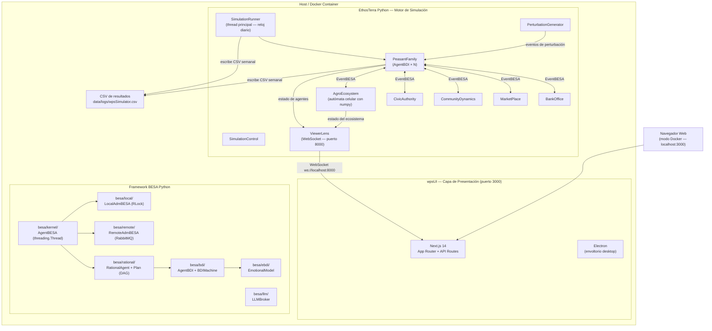

# Arquitectura de EthosTerra (Python)

## Índice

1. [Visión General del Proyecto](#1-visión-general-del-proyecto)
2. [Diagrama de Arquitectura del Sistema](#2-diagrama-de-arquitectura-del-sistema)
3. [Framework BESA — Módulos Python](#3-framework-besa--módulos-python)
   - 3.1 [Kernel (agent, event, guard, mbox, adm)](#31-kernel)
   - 3.2 [Local (container single-machine)](#32-local)
   - 3.3 [Remote (RabbitMQ distribution)](#33-remote)
   - 3.4 [Rational (roles, planes, creencias)](#34-rational)
   - 3.5 [BDI (ciclo deliberativo + declarativo YAML)](#35-bdi)
   - 3.6 [eBDI (modelo emocional)](#36-ebdi)
   - 3.7 [LLM (metas emergentes)](#37-llm)
4. [Motor de Simulación — ethosterra-python](#4-motor-de-simulación--ethosterra-python)
   - 4.1 [Punto de Entrada y Argumentos CLI](#41-punto-de-entrada-y-argumentos-cli)
   - 4.2 [Catálogo de Agentes](#42-catálogo-de-agentes)
   - 4.3 [Jerarquía de Metas de PeasantFamily](#43-jerarquía-de-metas-de-peasantfamily)
   - 4.4 [Patrón Guard-Behavior-State](#44-patrón-guard-behavior-state)
   - 4.5 [SimulationRunner y Ciclo Diario](#45-simulationrunner-y-ciclo-diario)
5. [wpsUI — Frontend Web/Desktop](#5-wpsui--frontend-webdesktop)
6. [Flujos de Datos y Comunicación](#6-flujos-de-datos-y-comunicación)
7. [Arquitectura de Despliegue](#7-arquitectura-de-despliegue)
8. [Formato del Mundo (mediumworld.json)](#8-formato-del-mundo-mediumworldjson)
9. [Dependencias Externas Clave](#9-dependencias-externas-clave)

---

## 1. Visión General del Proyecto

**EthosTerra** es un simulador social multi-agente en Python 3.14 orientado a estimar la productividad y el bienestar de familias campesinas en contextos rurales colombianos. Combina:

- **Razonamiento cognitivo BDI** (Beliefs-Desires-Intentions) con extensiones emocionales, modelando decisiones autónomas de familias campesinas en horizontes temporales de uno o más años.
- **Arquitectura orientada a agentes BESA** (Behavior-oriented, Event-driven, Social, and Autonomous) para gestión concurrente de agentes paralelos mediante `threading.Thread`.
- **Automatización celular** con numpy para representar el ecosistema agrícola (cultivos, suelo, clima).
- **Visualización en tiempo real** del estado del mundo mediante una interfaz web/desktop construida con Next.js 14 y Electron.

El proyecto sirve como plataforma de experimentación para políticas agrarias, crédito rural y resiliencia comunitaria.

### Tecnologías Clave

| Capa | Tecnología | Versión |
|------|-----------|---------|
| Lenguaje backend | Python (free-threaded) | 3.14+ |
| Framework de agentes | BESA Python | 3.7.0 |
| Framework frontend | Next.js (React 18) | 14.2.15 |
| Desktop wrapper | Electron | ~32 |
| Estilos | Tailwind CSS | 3.4 |
| Contenedores | Docker + Docker Compose | 27+ |
| CI/CD | GitHub Actions | — |
| Persistencia opcional | Redis + PostgreSQL | 7.x + 16.x |

**Repositorios:**
- `besa-python/` — Framework genérico BESA (49 archivos, ~2,000 LOC)
- `ethosterra-python/` — Dominio EthosTerra (37 archivos, ~2,500 LOC)
- `wpsUI/` — Frontend Next.js + Electron (~70 archivos TypeScript)
- `data/ebdi/` — YAML specs: 37 goals + 37 plans (compartidos con versión original)
- `scripts/` — Utilidades de comparación y análisis

---

## 2. Diagrama de Arquitectura del Sistema



---

## 3. Framework BESA — Módulos Python

El framework BESA Python es la columna vertebral del motor de simulación. Está organizado en siete módulos.

### 3.1 Kernel

**Módulo:** `besa/kernel/` (10 archivos, 290 LOC)

Núcleo del framework. Define las abstracciones base de las que dependen todos los demás módulos.

| Componente | Archivo | Rol |
|-----------|---------|-----|
| `AgentBESA` | `agent.py` | `threading.Thread` con event loop: recv(mbox) → match_guard → exec_guard. PoisonPill para shutdown |
| `EventBESA` | `event.py` | `@dataclass(slots=True)` con id, prioridad, guard_type, data, sender, target |
| `GuardBESA` | `guard.py` | `ABC` con `func_exec_guard(event)` abstracto. `get_state()` devuelve el estado del agente |
| `MBoxBESA` | `mbox.py` | Wrapper `queue.Queue` con timeout y `threading.Event` para notificación |
| `StructBESA` | `struct.py` | Dict de `guard_type.__name__` → comportamiento. Routing por nombre de clase |
| `AdmBESA` | `adm.py` | `ABC` singleton con `register_agent`, `send`, `lookup`, `shutdown` |
| `AgentRNG` | `rng.py` | Generador thread-safe: `seed = root_seed + hash(alias) % 2**31` |
| `GuardErrorHandler` | `guard_error_handler.py` | Captura excepciones en guards sin matar el agente (structlog) |
| `PoisonPill` | `poison_pill.py` | `EventBESA` especial de shutdown |
| `Tracing` | `tracing.py` | structlog + trace_id por simulación |

### 3.2 Local

**Módulo:** `besa/local/` (2 archivos, 86 LOC)

| Componente | Archivo | Rol |
|-----------|---------|-----|
| `LocalAdmBESA` | `local_adm.py` | Extiende `AdmBESA`: `start_all()`, `shutdown(timeout)`. Enruta `send(event)` por alias |
| `LocalDirectory` | `local_directory.py` | `dict[alias, AgentBESA] + threading.RLock`. Thread-safe agent lookup |

### 3.3 Remote

**Módulo:** `besa/remote/` (5 archivos, 377 LOC)

| Componente | Archivo | Rol |
|-----------|---------|-----|
| `RabbitMQProducer` | `rabbitmq_producer.py` | `pika.BlockingConnection` + exchange `besa.exchange` |
| `RabbitMQConsumer` | `rabbitmq_consumer.py` | `pika.SelectConnection` thread, cola `besa.container.<alias>` |
| `DiscoveryConsumer` | `discovery_consumer.py` | fanout exchange `besa.discovery` para auto-descubrimiento |
| `RemoteAdmBESA` | `remote_adm.py` | Extiende `LocalAdmBESA` + bootstrap RabbitMQ + anuncio periódico |
| `ReconnectPolicy` | `reconnect_policy.py` | Backoff exponencial: `max_delay = 30s`, `max_retries = 10` |

### 3.4 Rational

**Módulo:** `besa/rational/` (5 archivos, 170 LOC)

| Componente | Archivo | Rol |
|-----------|---------|-----|
| `RationalAgent` | `rational_agent.py` | Extiende `AgentBESA`, registra 3 guards: PlanExecution, ChangeRole, PlanCancelation |
| `Plan` | `plan.py` | DAG de Tasks con dependencias: `add_task(task, depends_on=['prev'])` |
| `Task` | `task.py` | `ABC` con `execute(believes, **kwargs) → bool` |
| `RationalRole` | `rational_role.py` | Binding role_name → Plan |
| `Believes` | `believes.py` | Protocol + ABC para la base de conocimiento del agente |

### 3.5 BDI

**Módulo:** `besa/bdi/` (13 archivos, 543 LOC)

| Componente | Archivo | Rol |
|-----------|---------|-----|
| `AgentBDI` | `agent_bdi.py` | Extiende `RationalAgent`. Auto-registra `BDIDetectGuard` |
| `BDIMachine` | `bdi_machine.py` | 4 fases: Detect → Evaluate Viability → Score Contribution → Select. Multi-goal tick |
| `DesireHierarchyPyramid` | `desire_pyramid.py` | 6 niveles (SURVIVAL→ATTENTION_CYCLE). Selección por nivel + score |
| `GoalBDI` | `goal_bdi.py` | Protocol `BDIEvaluable` + `ABC` GoalBDI |
| `GoalLevel` | `goal_bdi_types.py` | Enum: SURVIVAL(0), DUTY(1), OPPORTUNITY(2), REQUIREMENT(3), NEED(4), ATTENTION_CYCLE(5) |

**Sistema Declarativo YAML** (`besa/bdi/declarative/`):

| Componente | Archivo | Rol |
|-----------|---------|-----|
| `GoalRegistry` | `goal_registry.py` | Singleton. Carga `data/ebdi/goals/*.yaml`. Lookup multi-path con `ETHOSTERRA_GOALS_DIR` |
| `PlanRegistry` | `plan_registry.py` | Singleton. Carga `data/ebdi/plans/*.yaml` con StepSpec (id, action, args) |
| `GoalSpec` | `goal_spec.py` | `@dataclass`: id, display_name, pyramid_level, activation_when, plan_ref, contribution_rules, effects |
| `PlanSpec` | `plan_spec.py` | `@dataclass`: id, steps (list[StepSpec]) |
| `DeclarativeGoal` | `declarative_goal.py` | YAML → GoalBDI. `detect_goal()` vía `evaluate_activation()`. `goal_succeeded()` genérico |
| `GoalEngine` | `goal_engine.py` | scikit-fuzzy wrapper para evaluación fuzzy de contribución |
| `ActionRegistry` | `action_registry.py` | 16 acciones primitivas: consume_resource, update_belief, send_event, emit_emotion, etc. |
| `yaml_evaluator.py` | `yaml_evaluator.py` | `StateProxy` (camelCase→snake_case). Traduce `&&`/`||`/`!`/ternarios. `_get_belief()` lookup |

### 3.6 eBDI

**Módulo:** `besa/ebdi/` (4 archivos, 111 LOC)

| Componente | Archivo | Rol |
|-----------|---------|-----|
| `EmotionalState` | `emotional_event.py` | 8 ejes emocionales (joy, sadness, anger, fear, surprise, trust, anticipation, disgust) |
| `EmotionalEvent` | `emotional_event.py` | Tupla (person, event, object) con intensidad y valencia |
| `EmotionalModel` | `emotional_model.py` | ABC con `process_emotional_event()`. Estado emocional unificado |
| `SemanticDictionary` | `semantic_dictionary.py` | Singleton de valores semánticos (relaciones persona/evento/objeto) |

**Sistema emocional del dominio** (`ethosterra-python/`):

| Componente | Archivo | Rol |
|-----------|---------|-----|
| `EmotionalEvaluator` | `emotional_evaluator.py` | Fuzzy logic con scikit-fuzzy. 3 ejes (HappinessSadness, HopefulUncertainty, SecureInsecure) → EmotionalState (0-1) |
| `process_emotional_event` | `emotional_evaluator.py` | 30+ influencias por tipo de evento (LEISURE=0.7, THIEVING=0.8, HARVESTING=0.5, etc.) |

### 3.7 LLM

**Módulo:** `besa/llm/` (4 archivos, 191 LOC)

| Componente | Archivo | Rol |
|-----------|---------|-----|
| `LLMBroker` | `llm_broker.py` | Thread dedicado con `queue.Queue`. Serializa requests. CircuitBreaker + AgentRateLimiter |
| `LLMCache` | `llm_cache.py` | LRU cache thread-safe (max 500 entradas) |
| `LLMRequest/Response` | `llm_client.py` | Dataclasses: template, context, callback_agent, callback_guard |

---

## 4. Motor de Simulación — ethosterra-python

### 4.1 Punto de Entrada y Argumentos CLI

**Archivo:** `ethosterra/start.py`  
**Comando:** `python ethosterra-python/ethosterra/start.py [opciones]`

| Flag | Tipo | Descripción | Default |
|------|------|------------|---------|
| `--mode` | string | Container alias | `single` |
| `--role` | string | `primary` (servicios+peasants) o `worker` | `primary` |
| `--agents` | int | Número de PeasantFamily | 5 |
| `--money` | int | Capital inicial por familia (COP) | 1500000 |
| `--land` | int | Parcelas por familia | 6 |
| `--personality` | float | Varianza de personalidad | 0.3 |
| `--tools` | int | Herramientas iniciales | 10 |
| `--seeds` | int | Semillas iniciales | 10 |
| `--water` | int | Agua inicial | 10 |
| `--irrigation` | 0\|1 | Riego habilitado | 1 |
| `--emotions` | 0\|1 | Módulo emocional | 1 |
| `--training` | 0\|1 | Capacitación | 1 |
| `--years` | int | Años de simulación | 1 |
| `--speed` | float | Segundos por día simulado | 0.001 |
| `--world` | string | Archivo de mundo | `mediumworld.json` |
| `--perturbation` | string | Tipo de perturbación | (ninguno) |

**Flujo de inicio:**
1. `parse_args()` → `SimulationParams`
2. `LocalAdmBESA(alias=mode)` — crea container
3. `SimulationClock.set_current_date("01/01/2024")`
4. `create_services()` → CommunityDynamics, MarketPlace, CivicAuthority, BankOffice, PerturbationGenerator
5. `GoalRegistry.get_instance()` + `PlanRegistry.get_instance()` → cargar 37+37 YAML
6. `create_peasants()` → SimulationControl, ViewerLens, N × PeasantFamily
7. `SimulationRunner.start()` → loop diario automático

### 4.2 Catálogo de Agentes

| Agente | Clase Base | Rol |
|--------|----------|-----|
| **PeasantFamily** | `AgentBDI` | Actor principal: gestiona ingresos, tierra, salud, cultivos mediante jerarquía BDI de 6 niveles |
| **SimulationControl** | `AgentBESA` | Reloj de simulación; mapa de agentes vivos/muertos; chequeo de sincronización |
| **AgroEcosystem** | `AgentBESA` | Autómata celular con modelo FAO-56: 7 tipos de cultivo, GDD, estrés hídrico, enfermedad |
| **BankOffice** | `AgentBESA` | Crédito agrícola: préstamos formales/informales, tabla de pagos a 12 meses |
| **MarketPlace** | `AgentBESA` | Precios de insumos (semillas, agua, herramientas) y transacciones compra/venta |
| **CommunityDynamics** | `AgentBESA` | Contratos laborales entre familias, colaboración social |
| **CivicAuthority** | `AgentBESA` | Asignación de tierras, slots de capacitación, regulaciones |
| **PerturbationGenerator** | `AgentBESA` | Eventos estocásticos: sequías, inundaciones, plagas |
| **ViewerLens** | `AgentBESA` | Servidor WebSocket (puerto 8000): transmite estado del mundo en tiempo real |
| **LLMBroker** | `Thread` | (Opcional) Thread dedicado para llamadas LLM no bloqueantes |

### 4.3 Jerarquía de Metas de PeasantFamily

Organizadas en 6 niveles (SURVIVAL → ATTENTION_CYCLE). El `BDIMachine` evalúa cada tick qué metas están activas según las creencias y selecciona la de mayor prioridad.

```
Nivel 6 — ATTENTION_CYCLE (ocio y bienestar)
   LeisureActivitiesGoal | SpendFamilyTimeGoal | SpendFriendsTimeGoal
   WasteTimeAndResourcesGoal | FindNewsGoal

Nivel 5 — NEED (lazos sociales)
   CommunicateGoal | LookForCollaborationGoal | ProvideCollaborationGoal

Nivel 4 — REQUIREMENT (capacidades)
   ObtainSeedsGoal | ObtainToolsGoal | ObtainWaterGoal | ObtainPesticidesGoal
   ObtainLandGoal | GetTrainingGoal | ObtainLivestockGoal | GetPriceListGoal
   AlternativeWorkGoal | ObtainSuppliesGoal

Nivel 3 — OPPORTUNITY (desarrollo productivo)
   CheckCropsGoal | HarvestCropsGoal | ManagePestsGoal | PlantCropGoal
   PrepareLandGoal | DeforestLandGoal | SellCropGoal | SearchForHelpGoal
   WorkForOtherGoal | AttendReligiousEventsGoal

Nivel 2 — DUTY (obligaciones)
   LookForLoanGoal | PayDebtsGoal

Nivel 1 — SURVIVAL (supervivencia)
   DoVitalsGoal | DoHealthcareGoal | DoVoidGoal | SeekPurposeGoal | SelfEvaluationGoal
```

### 4.4 Patrón Guard-Behavior-State

Todos los agentes siguen este patrón reactivo:

```
Sender → EventBESA(guard_type=X, data=D) → AdmBESA.send(event) → Target.mbox.send(event)
→ Agent.run() recv → StructBESA.get_guard(event) → guard.func_exec_guard(event)
→ guard.get_state() → leer/actualizar estado
```

**Guards de PeasantFamily (comunicación inter-agente):**

| Guard | Evento que maneja |
|-------|------------------|
| `FromBankOfficeGuard` | Respuesta de aprobación/rechazo/cuota de préstamo |
| `FromMarketPlaceGuard` | Confirmación de compra/venta de recursos |
| `FromCivicAuthorityGuard` | Asignación de tierra, capacitación |
| `FromCivicAuthorityTrainingGuard` | Slot de entrenamiento disponible |
| `FromAgroEcosystemGuard` | Notificaciones de cultivo (estrés hídrico, enfermedad, cosecha lista) |
| `FromSimulationControlGuard` | Sincronización de reloj |
| `SocietyWorkerContractGuard` | Oferta de contrato laboral |
| `SocietyWorkerContractorGuard` | Trabajador encontrado |
| `PeasantWorkerContractFinishedGuard` | Fin de contrato laboral |
| `HeartBeatGuard` | Pulso periódico (BDI cycle driver) |
| `StatusGuard` | Consultas de estado |

**Routing de eventos:** `StructBESA.get_guard(event)` — match por `guard_type.__name__`. Las clases con el mismo nombre (ej: `FromCivicAuthorityGuard`) en distintos módulos se resuelven correctamente.

### 4.5 SimulationRunner y Ciclo Diario

**Archivo:** `ethosterra/simulation_runner.py`

```
POR CADA DÍA:
  1. AgroEcosystem.update_for_date() → avanzar crecimiento de cultivos
  2. POR CADA PEASANT:
     a. new_day = True, current_date = hoy
     b. Costo diario: daily_cost = 5000 + food_security * 3000
     c. Salud/hambre: si money < minimum_vital → crisis
     d. Venta de emergencia: si money=0 → vender seeds/tools
     e. Ciclo agrícola automático:
        - stage NONE → PLANTING (preparar tierra)
        - stage PLANTING → GROWING (sembrar)
        - stage GROWING + día > 120 → HARVEST_READY
        - stage HARVEST_READY → cosecha + ingreso (100-300 kg × $3000/kg)
     f. tick_bdi() → BDIMachine: detectar→evaluar→seleccionar→ejecutar planes
     g. money = max(0, money)
  3. CADA SEMANA: _write_csv() → wpsSimulator.csv (14 columnas)
  4. clock.advance_one_day()
```

**Salida CSV (14 columnas):**
date, agent, money, health, happiness, emotion, current_goal, harvested_weight, lands_count, loans_active, days_in_crisis, social_capital, food_security, task_log

---

## 5. wpsUI — Frontend Web/Desktop

(Sin cambios respecto a la versión anterior — se conecta al motor Python mediante las mismas APIs y WebSocket)

El frontend es una aplicación dual-mode: aplicación desktop (Electron) o aplicación web (Docker, puerto 3000).

### Stack Tecnológico
Next.js 14, React 18, TypeScript, Electron, Tailwind CSS, Radix UI, Recharts, Leaflet, PapaParse.

### API REST

| Endpoint | Método | Acción |
|----------|--------|--------|
| `/api/simulator` | `GET` | Estado del proceso Python |
| `/api/simulator` | `POST` | Lanza el proceso Python con argumentos |
| `/api/simulator` | `DELETE` | Detiene la simulación |
| `/api/simulator/csv` | `GET` | Lee `wpsSimulator.csv` |
| `/api/simulator/csv` | `DELETE` | Limpia el CSV |

### WebSocket (ViewerLens, puerto 8000)

| Prefijo | Contenido |
|---------|-----------|
| `q=` | Cantidad de agentes activos |
| `d=` | Fecha actual de simulación |
| `j=` | Estado JSON de un agente |
| `e=` | Fin de simulación |

---

## 6. Flujos de Datos y Comunicación

### Lanzamiento de Simulación

```
Usuario → Settings.tsx → POST /api/simulator → python ethosterra/start.py --agents N ...
  → LocalAdmBESA → crear servicios → crear campesinos → SimulationRunner.start()
  → Loop diario → escribe CSV semanal → ViewerLens transmite vía WebSocket
```

### Comunicación Inter-Agente

```
PeasantFamily.tick_bdi()
  → DeclarativeGoal.detect_goal() → yaml_evaluator.evaluate_activation()
  → BDIMachine.select() → DeclarativeGoal.goal_succeeded()
  → PlanExecutor.execute_plan() → ActionRegistry[action].execute(believes, args)
  → send_guard_event_fn(target, msg_type, data)
  → AdmBESA.lookup(target).send_to(EventBESA(guard_type=..., data=...))
  → target_agent.run() → _route_event() → guard.func_exec_guard()
  → Response → AdmBESA.send(peasant_alias, EventBESA(guard_type=FromXGuard, data=...))
  → peasant inbox → FromXGuard.func_exec_guard() → update believes
```

---

## 7. Arquitectura de Despliegue

### Dockerfile.python (Multi-etapa)

```
Stage 1 (builder): python:3.14-slim + gcc libpq-dev → pip install requirements.txt
Stage 2 (runtime): python:3.14-slim + libpq5 → copy venv + code

ENTRYPOINT ["python", "-m", "ethosterra.start"]
```

### docker-compose.python.yml

```yaml
services:
  redis:       # Perfil: redis / full — persistencia de creencias
  postgres:    # Perfil: postgres / full — almacenamiento de episodios
  rabbitmq:    # Perfil: distributed — simulación multi-nodo
  simulator:   # Motor principal (siempre)
    ports: ["8000:8000"]  # ViewerLens WebSocket
    command: ["--agents", "10", "--years", "3", "--speed", "0.0001"]
    depends_on: [redis, postgres, rabbitmq]  # todos opcionales con fallback
  simulator-dev:  # Perfil: dev — hot reload con volúmenes montados
    ports: ["8001:8000"]
    command: ["--agents", "3", "--years", "1", "--speed", "0.005"]
```

### Variables de Entorno

| Variable | Default | Descripción |
|----------|---------|-------------|
| `ETHOSTERRA_ROOT` | `.` | Raíz del proyecto |
| `ETHOSTERRA_GOALS_DIR` | `data/ebdi/goals` | Ruta de YAML de metas |
| `ETHOSTERRA_PLANS_DIR` | `data/ebdi/plans` | Ruta de YAML de planes |
| `ETHOSTERRA_LOGS_PATH` | `data/logs/wpsSimulator.csv` | Ruta de salida CSV |
| `REDIS_HOST` | `localhost` | Host Redis (opcional) |
| `POSTGRES_HOST` | `localhost` | Host PostgreSQL (opcional) |

### CI/CD (GitHub Actions)

Archivo: `.github/workflows/python-ci.yml`
- Triggers: push a main/develop, pull requests
- Jobs: 5 suites de test + smoke test de 1 año (Python 3.13 y 3.14)

---

## 8. Formato del Mundo (mediumworld.json)

Archivos en `data/worlds/`. Define parcelas de tierra agrícola:

```json
{
  "size": 400,
  "climate": "tropical",
  "hemisphere": "northern",
  "latitude": 4.0,
  "temperature_avg": 25.0,
  "rainfall_annual": 1500,
  "soil_type": "LOAM",
  "crops": ["maiz", "frijol", "cafe", "platano"],
  "monthly_data": {
    "1": {"tmax": 28, "tmin": 18, "rainfall": 80},
    ...
  }
}
```

El `WorldConfiguration` singleton carga estos archivos. El `MonthlyDataLoader` proporciona datos climáticos mensuales para el modelo FAO-56.

---

## 9. Dependencias Externas Clave

### Backend (Python)

| Librería | Versión | Función |
|---------|---------|---------|
| `pydantic` | 2.9+ | Validación de datos de creencias |
| `pyyaml` | 6.0+ | Carga de specs de goals/planes |
| `sortedcontainers` | 2.4+ | Pirámide de deseos ordenada |
| `simpleeval` | 1.0+ | Evaluación de expresiones de activación |
| `structlog` | 24.0+ | Logging estructurado con trace_id |
| `numpy` | 2.1+ | Cálculos del autómata celular |
| `scikit-fuzzy` | 0.5+ | Evaluación fuzzy (GoalEngine + EmotionalEvaluator) |
| `httpx` | 0.27+ | Cliente HTTP para llama-server (LLM) |
| `pika` | 1.3+ | Cliente RabbitMQ (distribución) |
| `redis` | 5.0+ | Persistencia de creencias (opcional) |
| `psycopg2` | 2.9+ | Almacenamiento de episodios (opcional) |
| `websockets` | 12.0+ | Servidor WebSocket de ViewerLens |

### Frontend (wpsUI)

> Ver `wpsUI/package.json` para la lista completa.
