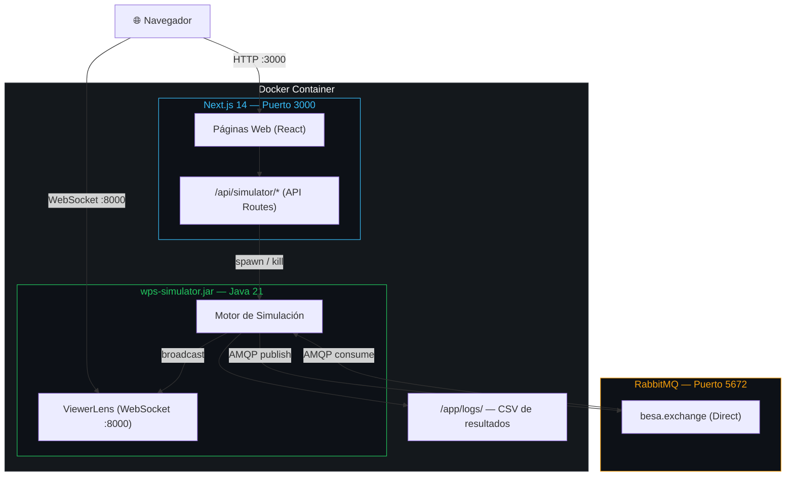
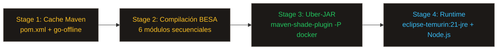
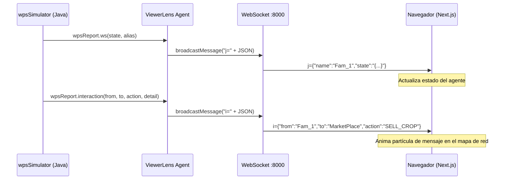
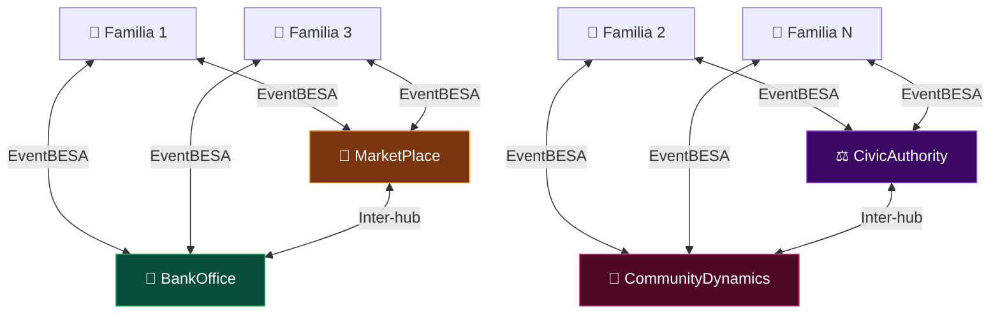
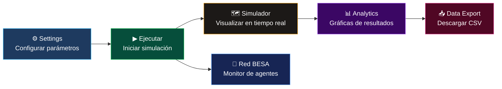

# EthosTerra — Simulador Social BDI Híbrido (TEMSCON-LATAM 2026)

**EthosTerra** (anteriormente WellProdSim) es una plataforma de simulación multi-agente desarrollada por el grupo **SIDRePUJ / ISCOUTB (UTB)**. Esta versión integra el framework **TEMSCON-LATAM 2026**, incorporando un motor cognitivo híbrido que combina la eficiencia del motor numérico eBDI con la capacidad de razonamiento semántico de un LLM (Gemma 4B).

---

## Arquitectura WPSnext



- **wellprodsim**: El motor de simulación original en Java que gestiona los agentes eBDI.
- **wpsllm-sidecar**: Un intermediario en Python que implementa la lógica híbrida (decide si usar LLM o motor numérico).
- **llama-cpp**: Servidor de inferencia local optimizado para GPUs con 8GB VRAM (como la RTX 4060).

---

### Cadena de dependencias BESA (Maven)


Cada módulo se compila e instala en `~/.m2` estrictamente en este orden dentro del `Dockerfile` multi-stage.

---

### Pipeline Docker (Multi-stage Build)



---

### Flujo de datos en tiempo real (WebSocket ViewerLens)



---

### Topología de agentes en la simulación



---

### Flujo de simulación (usuario)



---

## Repositorios incluidos

- **Motor Cognitivo Híbrido**: El LLM solo se activa en ciclos de alta significancia (crisis de salud, deudas, cambios de temporada), optimizando el rendimiento.
- **Doble Registro (Metrics Recorder)**: Cada decisión se registra comparando el motor numérico vs. el LLM para análisis de divergencia estadística.
- **Optimización de Ritmo**: Configurado para manejar 20 agentes concurrentes con una latencia media de ~18-25s por día simulado.
- **Persistencia Robusta**: Logs estructurados en formato `.jsonl` en `output/metrics/` para procesamiento posterior en Python/R.

---

## Prerrequisitos

- **Docker y Docker Compose v2+**
- **NVIDIA GPU** con soporte `nvidia-container-toolkit` (recomendado: 8GB VRAM+)
- **Modelo GGUF**: Requiere `gemma-4-E4B-it-Q4_K_M.gguf` en el directorio `models/`.

---

## Ejecución Rápida

Utilice el `Makefile` incluido para gestionar la simulación:

```bash
# 1. Descargar el modelo (si no existe)
make download

# 2. Levantar toda la infraestructura
make up

# 3. Ver logs de ejecución
make logs

# 4. Detener servicios
make down
```

---

## Herramientas de Investigación

El sidecar expone utilitarios para validar la configuración del experimento:

| Comando | Descripción |
| :--- | :--- |
| `make benchmark` | Ejecuta 10 pulses sintéticos para medir latencia TTFT y Total. |
| `make metrics` | Genera un reporte agregado de la divergencia LLM vs. Numérico. |
| `make clean` | Elimina los logs de métricas y limpia volúmenes de Docker. |

---

## Configuración del Motor Híbrido

Los umbrales de activación se configuran en `wpsllm-sidecar/config.py` o vía variables de entorno en el `docker-compose.yml`:

- `HYBRID_MONEY_THRESHOLD`: $500,000 COP
- `HYBRID_HEALTH_THRESHOLD`: 30/100
- `LLM_TIMEOUT`: 25.0s (con reintento inmediato en caso de congestión).

---

## Estructura del Proyecto

- `wpsSimulator/`: Código fuente del motor Java y DTOs de comunicación.
- `wpsllm-sidecar/`: Lógica de prompt engineering, métricas y API FastAPI.
- `models/`: Almacenamiento local del modelo Gemma (excluido de Git).
- `output/metrics/`: Resultados de las sesiones de simulación.

---

**Cita y Referencia:**
Este trabajo forma parte del framework *TEMSCON-LATAM 2026: Hybrid Social Simulation for Rural Prosperity*.
