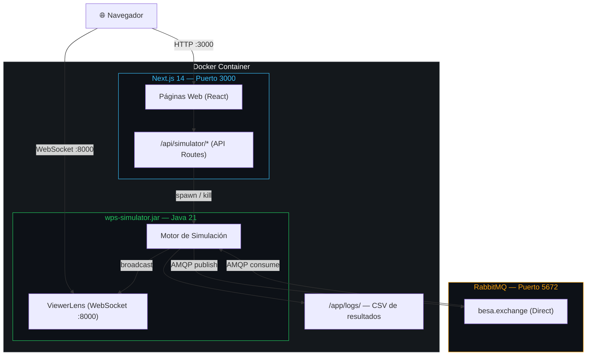
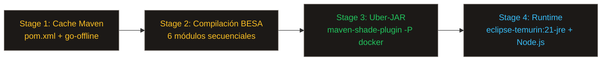
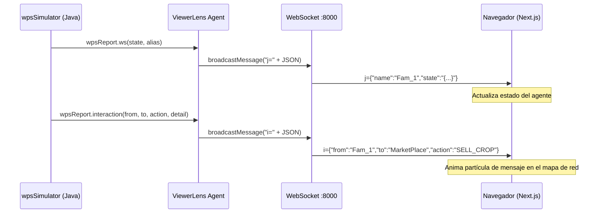
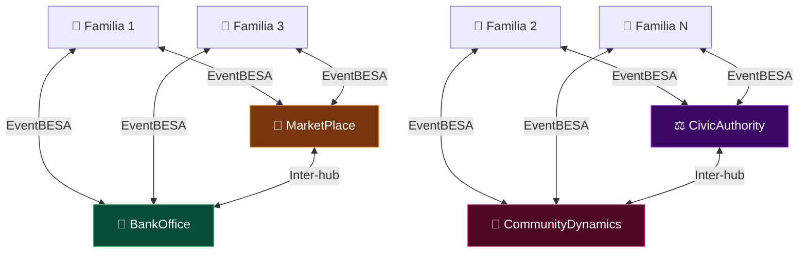
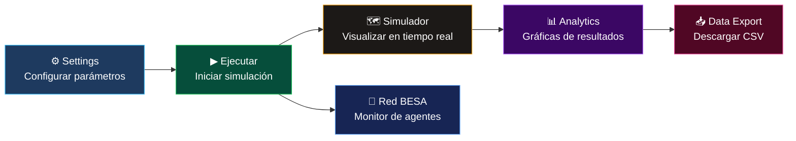

# EthosTerra — Simulador Social de Productividad y Bienestar para Familias Campesinas

EthosTerra (anteriormente WellProdSim) es una plataforma de simulación multi-agente desarrollada por el grupo **SIDRePUJ / ISCOUTB (UTB)**. Modela el comportamiento de familias campesinas colombianas mediante agentes BDI (Belief-Desire-Intention) con componentes emocionales, simulando decisiones agrícolas, económicas y de bienestar a lo largo del tiempo.

---

## Arquitectura general



El frontend web se comunica con el motor Java mediante API Routes de Next.js que reemplazan el sistema IPC de Electron original.

---

### Cadena de dependencias BESA (Maven)


Cada módulo se compila e instala en `~/.m2` estrictamente en este orden dentro del `Dockerfile` multi-stage.

---

### Pipeline Docker (Multi-stage Build)



---

### Flujo de datos en tiempo real (WebSocket ViewerLens)



---

### Topología de agentes en la simulación



---

### Flujo de simulación (usuario)



---

## Repositorios incluidos

| Repositorio            | Descripción                                     |
| ---------------------- | ----------------------------------------------- |
| `ISCOUTB/KernelBESA`   | Núcleo del framework de agentes BESA            |
| `ISCOUTB/LocalBESA`    | Implementación local del administrador BESA     |
| `ISCOUTB/RemoteBESA`   | Implementación distribuida BESA                 |
| `ISCOUTB/RationalBESA` | Agentes racionales BESA                         |
| `ISCOUTB/BDIBESA`      | Agentes BDI sobre BESA                          |
| `ISCOUTB/eBDIBESA`     | Agentes BDI con componente emocional            |
| `ISCOUTB/wpsSimulator` | Motor principal del simulador (fat JAR)         |
| `ISCOUTB/wpsUI`        | Interfaz web (Next.js 14 + Tailwind + Recharts) |

---

## Prerrequisitos

Solo necesitas **Docker Desktop** instalado y en ejecución.

- [Descargar Docker Desktop](https://www.docker.com/products/docker-desktop/)
- Versión mínima probada: Docker 29.x + Compose 5.x

No se requiere instalar Java, Node.js, Maven ni ninguna dependencia adicional en el equipo host.

---

## Instalación y ejecución (primera vez)

### 1. Clonar los repositorios

```bash
git clone https://github.com/ISCOUTB/KernelBESA.git
git clone https://github.com/ISCOUTB/LocalBESA.git
git clone https://github.com/ISCOUTB/RemoteBESA.git
git clone https://github.com/ISCOUTB/RationalBESA.git
git clone https://github.com/ISCOUTB/BDIBESA.git
git clone https://github.com/ISCOUTB/eBDIBESA.git
git clone https://github.com/ISCOUTB/wpsSimulator.git
git clone https://github.com/ISCOUTB/wpsUI.git
```

> Todos los repositorios deben quedar al **mismo nivel** de directorio (requerido por las rutas relativas `systemPath` del `pom.xml` de `wpsSimulator`).

### 2. Construir la imagen

```bash
docker compose build
```

Este proceso tarda aproximadamente **7-8 minutos** la primera vez. Realiza:

1. Compilación de los 6 módulos BESA con Maven (Java 21)
2. Compilación de `wpsSimulator` generando el fat JAR
3. Instalación de dependencias Node.js y compilación de Next.js

Las siguientes ejecuciones usan caché de Docker y tardan solo **3-4 minutos**.

### 3. Iniciar la aplicación

```bash
docker compose up -d
```

### 4. Abrir en el navegador

```
http://localhost:3000
```

---

## Uso

### Flujo de una simulación

1. **Settings** (`/pages/settings`) — Configura los parámetros de la simulación:
   - Número de agentes campesinos (1–1000)
   - Capital inicial en pesos
   - Hectáreas de terreno
   - Personalidad, herramientas, semillas, agua, riego, emociones
   - Años a simular

2. **Ejecuta la simulación** — Pulsa el botón de inicio. El motor Java corre en segundo plano; el estado se actualiza en tiempo real via polling cada 2 segundos.

3. **Simulador** (`/pages/simulador`) — Visualiza el progreso mientras la simulación corre.

4. **Analytics** (`/pages/analytics`) — Analiza los resultados con gráficas de series de tiempo una vez que la simulación finaliza.

5. **Data Export** (`/pages/dataExport`) — Descarga los resultados en CSV.

---

## Comandos útiles

```bash
# Ver logs en tiempo real
docker compose logs -f

# Detener el contenedor
docker compose down

# Reiniciar sin rebuild
docker compose up -d

# Rebuild completo (tras cambios en el código)
docker compose up --build -d

# Ver estado del simulador desde terminal
curl http://localhost:3000/api/simulator

# Abrir una shell dentro del contenedor
docker exec -it simulacion-wellprodsim-1 sh
```

---

## API interna (para desarrollo)

| Endpoint                  | Método   | Descripción                                    |
| ------------------------- | -------- | ---------------------------------------------- |
| `/api/simulator`          | `GET`    | Estado del proceso Java `{"running": bool}`    |
| `/api/simulator`          | `POST`   | Lanzar simulación con `{"args": [...]}`        |
| `/api/simulator`          | `DELETE` | Matar el proceso Java en curso                 |
| `/api/simulator/csv`      | `GET`    | Leer el CSV de resultados                      |
| `/api/simulator/csv`      | `DELETE` | Vaciar el CSV                                  |
| `/api/simulator/file`     | `GET`    | Verificar existencia de archivo `?path=<ruta>` |
| `/api/simulator/file`     | `DELETE` | Eliminar un archivo `?path=<ruta>`             |
| `/api/simulator/app-path` | `GET`    | Ruta base de la aplicación                     |

---

## Estructura del workspace

```
simulacion/
├── KernelBESA/          ← Framework BESA — núcleo
├── LocalBESA/           ← Framework BESA — local
├── RemoteBESA/          ← Framework BESA — distribuido
├── RationalBESA/        ← Framework BESA — agentes racionales
├── BDIBESA/             ← Framework BESA — BDI
├── eBDIBESA/            ← Framework BESA — BDI emocional
├── wpsSimulator/        ← Motor Java del simulador
├── wpsUI/               ← Interfaz web Next.js
│   ├── src/
│   │   ├── app/
│   │   │   ├── api/simulator/     ← API Routes (reemplazan IPC de Electron)
│   │   │   └── pages/             ← Rutas de la UI
│   │   ├── components/
│   │   │   └── ElectronPolyfill.tsx  ← Adaptador IPC→HTTP
│   │   └── lib/
│   │       └── javaProcessState.ts  ← Estado del proceso Java (singleton)
│   └── next.config.mjs
├── Dockerfile
├── docker-compose.yml
└── .dockerignore
```
