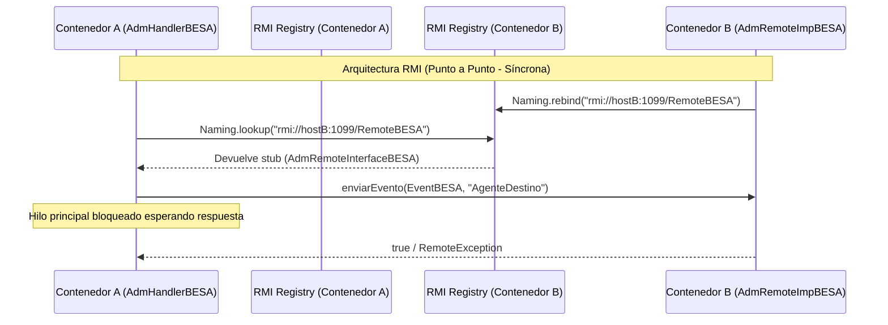
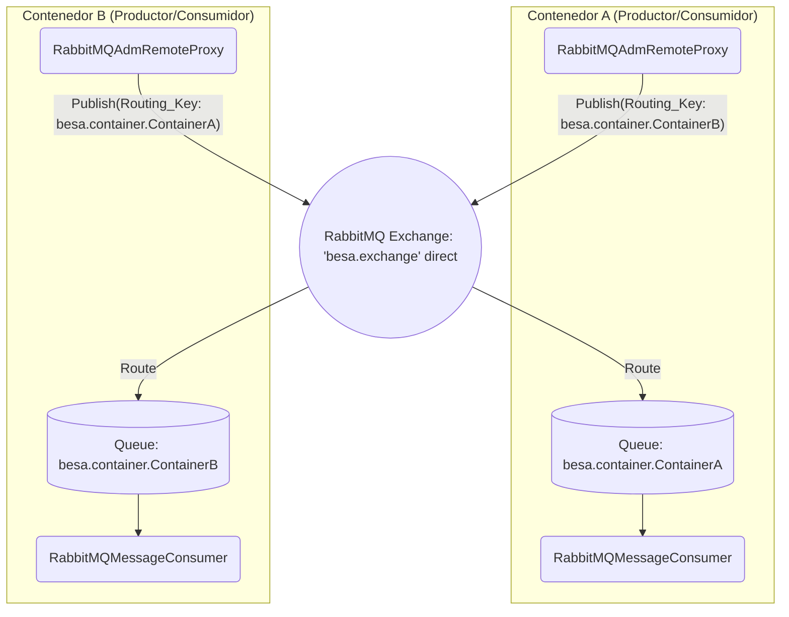
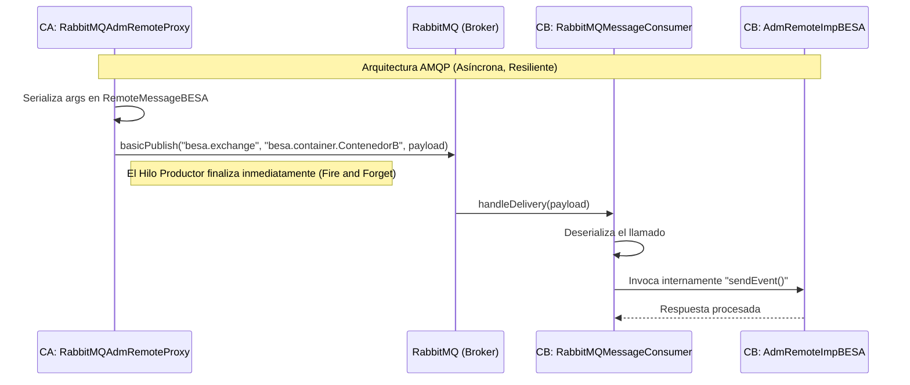

# BESA Arquitectura de Comunicación: RMI vs RabbitMQ

Este documento detalla la transición arquitectónica del subsistema de comunicación entre contenedores BESA (`KernelBESA` y `RemoteBESA`), reemplazando el uso nativo de *Java RMI (Remote Method Invocation)* por un sistema asíncrono y desacoplado basado en *RabbitMQ*.

---

## ⛔ Antes: Arquitectura basada en RMI (Síncrona - Punto a Punto)

Históricamente, los contenedores de BESA utilizaban `RMI` para interactuar. Cada contenedor iniciaba un hilo `rmiregistry` y se enlazaba con una instancia de `AdmRemoteImpBESA` exponiéndose a la red mediante `Naming.rebind`. 
Cuando un contenedor "A" necesitaba comunicarse con un contenedor "B", efectuaba un `Naming.lookup(rmiUrl)` punto-a-punto y hacía llamadas bloqueantes (síncronas).



**Problemas del esquema RMI en Docker:**
- Dependencia estricta de nombres y hostnames que, en contenedores, pueden cambiar dinámicamente.
- Si el contenedor "B" reiniciaba, el registro de RMI se perdía y el contenedor "A" incurría en un `RemoteException` por "Stub muerto", sin reintentos automáticos elegantes.
- Bloquea los hilos de BESA si hay latencia de red.

---

## ✅ Ahora: Arquitectura basada en RabbitMQ (Asíncrona - Topología de Estrella)

La comunicación se orquesta enteramente a través de RabbitMQ. Se utiliza un único intercambio (`besa.exchange` de tipo `direct`) para dirigir los mensajes hacia colas anónimas por cada contenedor activo.

**Componentes Clave introducidos:**
1. **`RabbitMQManager`**: Singleton configurado automáticamente usando `System.getenv("RABBITMQ_HOST")` permitiendo así su integración perfecta con Docker Compose. Crea el puente y los canales de comunicación.
2. **`RabbitMQAdmRemoteProxy`**: Componente productor. Substituye enteramente al *lookup* de RMI. Actúa como Proxy interceptando las llamadas hacia otros administradores remotos (`bindRemoteService`, `sendEvent`, `moveAgentSend`, etc.). Serializa los argumentos con `RemoteMessageBESA` y los emite en el exchange usando la clave de ruteo (`Routing Key`): `besa.container.<AdmId_Destino>`.
3. **`RabbitMQMessageConsumer`**: Componente consumidor. Cada contenedor se suscribe a una cola exclusiva amarrada a dicho exchange, en donde inyecta y despacha lo recibido en la clase `AdmRemoteImpBESA` base, la cual dejó de heredar de `UnicastRemoteObject`.



**Flujo en RabbitMQ:**



**Ventajas Inmediatas:**
1. Tolerancia a Fallos de Red y Caídas: Si el "Contenedor B" cae, los mensajes esperarán en su cola asociada hasta que regenere su Healthcheck y se reconecte desde `docker-compose`. 
2. Performance Asíncrona: El contenedor B recibe eventos de todos los demás sin consumir memoria de Hilos RMI inactivos, acelerando la propagación de eventos inter-contenedores en BESA.
3. Adiós Conflicto de Puertos Locales: La multiplexación se maneja mediante RabbitMQ. No es necesario definir puertos RMI distintos entre contenedores que corren en un mismo nodo hospedador.

---

## 🧪 Cómo probar localmente (RabbitMQ + Agentes BESA + PingPong + MoveAgent)

Para certificar todo este diseño distribuido y validar que la persistencia en colas funciona durante la creación, comunicación, y migración (`moveAgentSend/moveAgentReceive`), puedes utilizar el orquestador en pruebas que incluimos:

1. Ejecuta el compose de prueba que construye el entorno y levanta _RabbitMQ_, _A_, _B_ y _C_:
   ```bash
   docker compose -f docker-compose.test.yml up --build
   ```
2. Analiza los Logs. Podrás visualizar cómo el **Contenedor A** inyecta eventos inter-agentes al **Contenedor B** 100 veces a través del *AMQP Consumer*. Una vez saturado dicho intercambio, verás en vivo el proxy serializando y migrando al agente desde **A** hacia el **Contenedor C** de forma transparente y sin error de dependencias.
